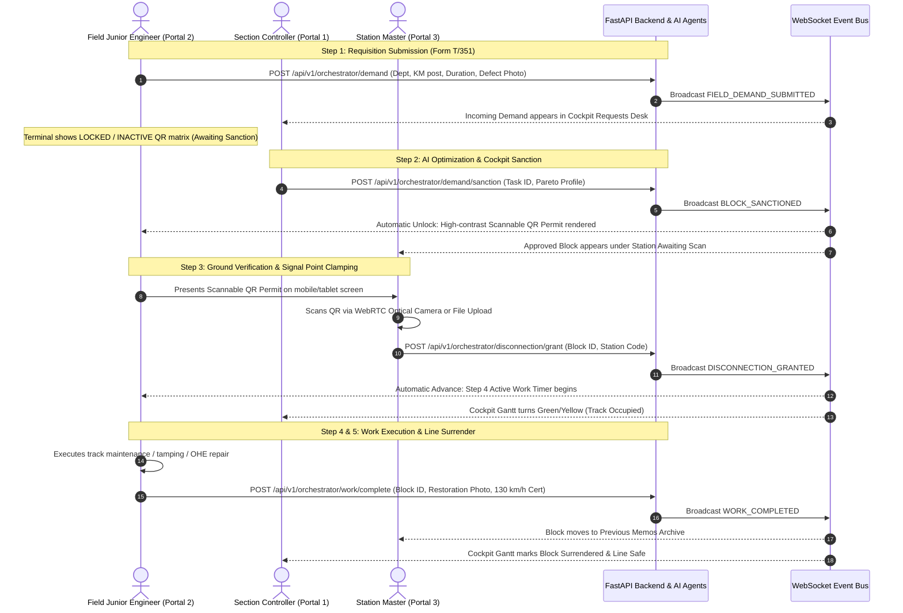

# RailBlock AI — Frontend API Integration & Handover Guide
**Project**: ₹100-Crore Multi-Agent Railway Corridor Operating System (IR-COAS)  
**Target Audience**: Frontend Engineering Team (Portals 1, 2, and 3)  
**Architecture Standard**: Next.js 15 (App Router) + Tailwind CSS + Zustand Store + FastAPI REST + WebSocket Event Bus  
**Theme Standard**: 100% Light Enterprise Theme (`#F8FAFC` slate background, `#FFFFFF` cards, `#0F2D6B` Indian Railways Navy)  

---

## 1. System Architecture & Multi-Portal Isolation

RailBlock AI consists of **three strictly decoupled, standalone operational portals**. Each portal represents a distinct physical operating terminal in Indian Railways and must **never** mix navigation or link directly to another portal.

```
┌─────────────────────────────────────────────────────────────────────────────────┐
│                               FASTAPI BACKEND                                   │
│              (REST: http://localhost:8000 | WS: ws://localhost:8000)             │
└────────┬───────────────────────────────┬───────────────────────────────┬────────┘
         │                               │                               │
         ▼                               ▼                               ▼
┌──────────────────┐           ┌──────────────────┐           ┌──────────────────┐
│     PORTAL 1     │           │     PORTAL 2     │           │     PORTAL 3     │
│Section Controller│           │ Field Junior Eng │           │  Station Master  │
│     Cockpit      │           │     Terminal     │           │  Operating Desk  │
│  `/cockpit` &    │           │ `/field/request` │           │    `/station`    │
│`/cockpit/requests`           │                  │           │                  │
└──────────────────┘           └──────────────────┘           └──────────────────┘
  Role: Corridor Controller      Role: Ground Field JE          Role: Station Master
  Jurisdiction: Full Section     Jurisdiction: Track Worksite   Jurisdiction: Station Yard
```

### Environment & Base URL Configuration

| Variable | Local Development | Production / Tunnel | Description |
| :--- | :--- | :--- | :--- |
| `NEXT_PUBLIC_API_BASE` | `http://localhost:8000` | Cloudflare / Vercel Tunnel | FastAPI REST API Root |
| `NEXT_PUBLIC_WS_URL` | `ws://localhost:8000/api/v1/ws/updates` | `wss://<host>/api/v1/ws/updates` | Live Telemetry Event Stream |

> [!IMPORTANT]
> **Enterprise Production Rule**: All demo, simulation, and hackathon labels have been permanently expunged. All buttons, labels, and modals must use authentic Indian Railways Operating Manual terminology (e.g. *Form T/351 Disconnection Memo*, *Signal Point Clamping at Danger*, *Line Fit-for-Traffic Speed 130 km/h Certification*).

---

## 2. End-to-End Operational Lifecycle & State Machine

Every maintenance possession follows the rigorous 5-step statutory Indian Railways Form T/351 lifecycle across the 3 portals:



---

## 3. Portal 1: Section Controller Cockpit

**Primary Route**: `/cockpit` (Radar & Schedule Engine)  
**Secondary Route**: `/cockpit/requests` (Form T/351 Field Demands Desk)  
**Assigned User**: K. R. Venkatesh, Chief Section Controller (SWR Bengaluru Division)

### 3.1 Views & Component Breakdown
1. **Corridor Gantt Radar (`CockpitRadar.tsx`)**:
   - Visualizes scheduled and active maintenance blocks across corridor stations (`SBC`, `KGI`, `BID`, `RMGM`, `CPT`, `MYA`, `MYS`).
   - Distinct Department Color Coding:
     - **Engineering (P-Way)**: Emerald / Green (`#059669`)
     - **Signal & Telecom (S&T)**: Sky / Blue (`#0284C7`)
     - **Traction Distribution (TRD)**: Amber / Orange (`#D97706`)
     - **Fused Joint Block**: Multi-accent border with prominent `[⚡ FUSED JOINT BLOCK]` pill and `+30m Saved` badge.
2. **Field Demands Desk (`/cockpit/requests` & `IncomingDemandsSection.tsx`)**:
   - Filter incoming Form T/351 requisitions by Department and User (`JE-01` to `JE-04`).
   - Inspect track defect before-photos.
   - Select Pareto Optimization Profile: `Balanced`, `Safety-Max` (zero VIP delay), or `Throughput-Max` (maximum freight tonnage).
   - One-click Sanction button to promote requisition to active possession.
3. **6 AI Agents Status Panel (`AgentStatusPanel.tsx`)**:
   - Telemetry strip displaying real-time health, latency (sub-50ms), and verification metrics of all 6 agents.
4. **Emergency Dynamic Re-optimization (`ActionToolbar.tsx` / `GroundEmergencyAlerts.tsx`)**:
   - Inject emergency rail fractures (USFD crack) with sub-250ms dynamic re-optimization.
   - Review ground hazard deferrals reported by Station Masters.

---

### 3.2 API Endpoints for Portal 1

#### 1. Generate Full Optimized Corridor Schedule
- **Endpoint**: `POST /api/v1/orchestrator/pipeline/full`
- **Purpose**: Runs full 6-agent cognitive pipeline (Ingestion &rarr; Priority &rarr; Fusion &rarr; CP-SAT &rarr; Safety Guardian &rarr; Ledger).
- **Request Headers**: `Content-Type: application/json`
- **Request Body**:
```json
{
  "plan_type": "WEEKLY",
  "section": "SBC-MYS",
  "horizon_days": 7,
  "pareto_profile": "Balanced",
  "persist_to_db": true
}
```
- **Response Schema (`200 OK`)**:
```json
{
  "plan_id": 104,
  "section": "SBC-MYS",
  "horizon_days": 7,
  "plan_type": "WEEKLY",
  "pareto_profile": "Balanced",
  "generated_at": "2026-09-12T19:30:00Z",
  "work_packages_count": 14,
  "total_demands_satisfied": 18,
  "metrics": {
    "total_downtime_minutes": 1680,
    "fusion_saved_minutes": 240,
    "passenger_punctuality_impact_pct": 0.0,
    "freight_throughput_loss_pct": 1.2,
    "solver_solve_time_ms": 42.1
  },
  "optimized_plan": {
    "blocks": [
      {
        "block_id": "BLK-SBC-MYS-01",
        "task_ids": [7842],
        "section": "SBC-MYS",
        "station": "MYA",
        "department": "Engineering",
        "block_type": "INTEGRATED_BLOCK",
        "scheduled_start": "2026-09-13T01:30:00Z",
        "scheduled_end": "2026-09-13T03:30:00Z",
        "duration_minutes": 120,
        "priority_score": 86.5,
        "conflict_score": 0.0,
        "downtime_saved_minutes": 30,
        "reason": "Through Rail Renewal & USFD Weld Replacement",
        "is_emergency": false
      }
    ]
  }
}
```

#### 2. Get Operational Status of All 6 AI Agents
- **Endpoint**: `GET /api/v1/agents/status`
- **Purpose**: Feeds the Cockpit Brain Inspector panel and guarantees SIL-4 compliance.
- **Response Schema (`200 OK`)**:
```json
{
  "status": "OPERATIONAL",
  "total_agents": 6,
  "active_agents": 6,
  "agents": [
    {
      "id": "guardian",
      "name": "Sentinel / Safety Guardian Agent",
      "role": "Zero-Conflict & SIL-4 Safety Assurance",
      "status": "ACTIVE",
      "latency_ms": 4.2,
      "capabilities": [
        "Zero premium passenger train collisions (Rajdhani, Vande Bharat)",
        "30-minute power isolation de-energization margin enforcement",
        "Automatic USFD and rail fracture priority escalation to 99.5"
      ],
      "verified": true,
      "metrics": "0 Conflicts • Headway > 30m • SIL-4 Certified"
    },
    {
      "id": "priority",
      "name": "Corridor Priority Agent",
      "role": "Pareto Profiles (Safety-Max, Throughput-Max, Balanced)",
      "status": "ACTIVE",
      "latency_ms": 16.4,
      "capabilities": [
        "XGBoost urgency scoring (0-100) with R2 >= 0.96",
        "TreeSHAP local feature explainability for Section Controllers",
        "Multi-objective Pareto tradeoff frontier synthesis"
      ],
      "verified": true,
      "metrics": "3 Active Frontiers • R2 = 0.966"
    },
    {
      "id": "fusion",
      "name": "Shadow Alignment / Integrated Fusion Agent",
      "role": "Multi-Department Joint Demand Bundling",
      "status": "ACTIVE",
      "latency_ms": 28.5,
      "capabilities": [
        "NetworkX bipartite graph matching within 35km radius",
        "Cross-department bundling (Engineering + S&T + TRD)",
        "30 to 90 minutes downtime savings per possession"
      ],
      "verified": true,
      "metrics": "Up to 50% Downtime Saved • 35km Radius"
    },
    {
      "id": "optimizer",
      "name": "CP-SAT Mathematical Optimization Agent",
      "role": "Google OR-Tools Constraint Programming Solver",
      "status": "ACTIVE",
      "latency_ms": 42.1,
      "capabilities": [
        "Discrete 15-minute interval constrained scheduling",
        "Single-line non-concurrency and capacity safety bounds",
        "Nocturnal maintenance window optimization (00:00 - 05:00)"
      ],
      "verified": true,
      "metrics": "100% Feasible Solution • 42.1ms Solve"
    },
    {
      "id": "interlocking",
      "name": "Ground Feasibility & Interlocking Agent",
      "role": "QR Token Validation & Electronic Signal Clamping",
      "status": "ACTIVE",
      "latency_ms": 8.9,
      "capabilities": [
        "HMAC SHA-256 cryptographic track possession QR token verification",
        "Field JE and Station Master handoff validation",
        "Station Master electronic interlocking (EI) signal point clamping"
      ],
      "verified": true,
      "metrics": "Cryptographic QR Validated • EI Route Clamped"
    },
    {
      "id": "emergency",
      "name": "Dynamic Re-optimization & Incident Agent",
      "role": "Sub-250ms Emergency Re-Route & Incident Recovery",
      "status": "ACTIVE",
      "latency_ms": 208.4,
      "capabilities": [
        "Sub-250ms dynamic emergency possession slot injection",
        "Preservation of previously approved and frozen blocks",
        "Zero disruption to premium passenger paths during incidents"
      ],
      "verified": true,
      "metrics": "208.4ms Dynamic Re-Solve (<250ms SLA)"
    }
  ]
}
```

#### 3. Fetch All Field Demands
- **Endpoint**: `GET /api/v1/orchestrator/demands`
- **Purpose**: Populates the Section Controller Field Demands Desk.
- **Response Schema (`200 OK`)**: Array of demand objects (`status: "PENDING_SANCTION" | "SANCTIONED" | "IN_PROGRESS" | "COMPLETED" | "DEFERRED"`).

#### 4. Sanction Field Demand (Form T/351 Approval)
- **Endpoint**: `POST /api/v1/orchestrator/demand/sanction`
- **Purpose**: Approves a field demand, allocates official memo code (`MEMO-SWR-MYA-2026-xxx`), and unlocks the Field JE's QR permit.
- **Request Body**:
```json
{
  "task_id": 7842,
  "section": "SBC-MYS",
  "department": "Engineering",
  "km_range": "KM 105.0 - 108.0",
  "reason": "Through Rail Renewal & USFD Weld Replacement",
  "duration_minutes": 120,
  "pareto_profile": "Balanced"
}
```
- **Response Schema (`200 OK`)**:
```json
{
  "id": "BLK-SBC-MYS-01",
  "block_id": "BLK-SBC-MYS-01",
  "task_id": 7842,
  "section": "SBC-MYS",
  "station": "MYA",
  "km_range": "KM 105.0 - 108.0",
  "department": "Engineering",
  "work_description": "Through Rail Renewal & USFD Weld Replacement",
  "scheduled_start": "01:30",
  "scheduled_end": "03:30",
  "scheduled_start_iso": "2026-09-13T01:30:00Z",
  "scheduled_end_iso": "2026-09-13T03:30:00Z",
  "duration_minutes": 120,
  "worker_memo_code": "MEMO-SWR-MYA-2026-081",
  "status": "APPROVED",
  "pareto_profile": "Balanced",
  "downtime_saved_minutes": 30
}
```

#### 5. Inject Emergency Track Defect (<250ms SLA)
- **Endpoint**: `POST /api/v1/orchestrator/emergency`
- **Purpose**: Triggers sub-250ms dynamic re-optimization preserving previously frozen blocks.
- **Request Body**:
```json
{
  "emergency_task": {
    "source_system": "TMS",
    "defect_type": "CRITICAL_USFD_RAIL_FRACTURE",
    "severity": 5,
    "department": "Engineering",
    "task_type": "RAIL_RENEWAL",
    "section": "SBC-MYS",
    "km_post": 105.4,
    "estimated_duration_minutes": 180,
    "description": "Emergency rail crack detected via ultrasonic flaw detector km 105.4."
  },
  "freeze_approved": true
}
```
- **Response Schema (`200 OK`)**:
```json
{
  "emergency_task_id": 999,
  "solve_time_ms": 208.4,
  "premium_trains_protected": true,
  "emergency_block": {
    "block_id": "EMG-SBCMYS-999",
    "section": "SBC-MYS",
    "department": "Engineering",
    "priority_score": 99.9,
    "duration_minutes": 180,
    "scheduled_start": "2026-09-12T19:45:00Z",
    "scheduled_end": "2026-09-12T22:45:00Z",
    "is_emergency": true
  },
  "delta_summary": {
    "rescheduled_blocks": 1,
    "preserved_frozen_blocks": 7,
    "emergency_granted_minutes": 180
  }
}
```

#### 6. Sanction Auto-Rescheduled Slot (After Ground Deferral)
- **Endpoint**: `POST /api/v1/orchestrator/sanction-rescheduled-slot`
- **Request Body**:
```json
{
  "block_id": "BLK-SBC-MYS-01",
  "scheduled_slot": "Tomorrow Night 01:30 - 04:00 IST"
}
```
- **Response Schema (`200 OK`)**: `{ "status": "SLOT_SANCTIONED", "block_id": "BLK-SBC-MYS-01" }`

#### 7. Digital Plan Approval / Sign-Off
- **Endpoint**: `POST /api/v1/orchestrator/approve/{plan_id}`
- **Request Body**:
```json
{
  "user_id": 1,
  "digital_signature": "SHA256-KRV-SWR-CONTROLLER-88392",
  "remarks": "Approved by Section Controller under Balanced Profile"
}
```

#### 8. Universal Platform State Reset
- **Endpoint**: `POST /api/v1/orchestrator/reset`
- **Purpose**: Clears all demands, sanctioned blocks, and local mock storage back to pristine zero state. Broadcasts `SYSTEM_RESET` event to all 3 websites.

---

## 4. Portal 2: Field Junior Engineer Terminal

**Primary Route**: `/field/request`  
**Target Users**: Field Junior Engineers operating on track  

### 4.1 Multi-User Tenant Isolation Architecture

The terminal supports 4 official pre-configured JE profiles (or any custom operator ID). State is strictly isolated using tenant-scoped keys in `localStorage`:

| User ID | Operator Name | Role | Department | Section | Default Station |
| :--- | :--- | :--- | :--- | :--- | :--- |
| `01` | P. Ramesh | Junior Engineer (JE / P-Way) | Engineering | `SBC-MYS` | Mandya (`MYA`) |
| `02` | Suresh Kumar | Junior Engineer (JE / S&T) | Signal & Telecom | `SBC-MYS` | Ramanagara (`RMGM`) |
| `03` | K. Venkatesh | Junior Engineer (JE / TRD) | Traction Distribution | `SBC-MYS` | Kengeri (`KGI`) |
| `04` | Ananya Sharma | Junior Engineer (Track Maint) | Engineering | `SBC-MYS` | Bidadi (`BID`) |

#### Tenant Storage Keys:
- `railblock_je_user_id`: Current logged-in operator ID (`01`, `02`, `03`, `04`).
- `railblock_field_active_req_id_${userId}`: Tracks active request strictly for this operator.
- Switching operators instantly unmounts the previous operator's draft/step and restores the selected operator's independent workflow state.

---

### 4.2 Step-by-Step Workflow & State Machine

```
┌─────────────────┐     Submit Form T/351     ┌─────────────────┐
│     STEP 1      │ ────────────────────────> │     STEP 2      │
│Digital Request  │                           │Awaiting Sanction│
│ & Defect Photo  │ <──────────────────────── │(Locked QR Matrix│
└─────────────────┘      Cancel / Reset       └────────┬────────┘
                                                       │
                                  Controller Sanctions │ (Auto-advances)
                                                       ▼
┌─────────────────┐   Disconnection Granted   ┌─────────────────┐
│     STEP 4      │ <──────────────────────── │     STEP 3      │
│Active Work Mode │    (Station Master Scans) │Sanctioned Permit│
│ & Live Countdown│                           │ (Scannable QR)  │
└────────┬────────┘                           └─────────────────┘
         │
         │ JE Surrenders Track (Uploads Completion Photo & 130 km/h Cert)
         ▼
┌─────────────────┐
│     STEP 5      │
│Restoration Done │
│& Track Cleared  │
└─────────────────┘
```

#### Step 1: Requisition Submission
- **Fields**: Department, Submitter Name, Section (`SBC-MYS`), KM From, KM To, Duration (minutes), Reason, Defect Photo Upload.
- **API Call**: `POST /api/v1/orchestrator/demand`
- **Request Body**:
```json
{
  "department": "Engineering",
  "section": "SBC-MYS",
  "km_from": 105.0,
  "km_to": 108.0,
  "duration_minutes": 120,
  "reason": "Through Rail Renewal & USFD Weld Replacement",
  "submitter_name": "P. Ramesh",
  "user_id": "01",
  "before_photo_url": "https://..."
}
```
- **Response Schema (`200 OK`)**:
```json
{
  "task_id": 7842,
  "status": "SUBMITTED",
  "department": "Engineering",
  "section": "SBC-MYS",
  "priority_score": 86.5,
  "message": "Block demand registered successfully with SWR Bengaluru Central Control (Task ID: TSK-7842)."
}
```

#### Step 2: Awaiting Sanction (Locked QR Code)
- Displays requisition summary and a **blurred/locked QR matrix**.
- A central warning badge informs the JE: *"QR CODE LOCKED • AWAITING CONTROLLER SANCTION"*.
- When the Section Controller sanctions the demand in Cockpit, the WebSocket broadcasts `BLOCK_SANCTIONED`, and the Field JE terminal **automatically unlocks and advances to Step 3**.
- A manual `Verify Sanction & Receive Permit (Form T/351)` button is also available.

#### Step 3: Sanctioned Possession & Scannable QR Permit
- Renders an authentic, scannable QR code canvas with the specialized token payload:
  `RAILBLOCK-v1::REQ-7842::01::7842::MEMO-SWR-MYA-2026-081::MYA::Engineering`
- The JE presents this QR code to the Station Master upon arrival at the station.

#### Step 4: Line Disconnection Granted (Active Work Mode)
- The instant the Station Master scans the QR code, the terminal receives `DISCONNECTION_GRANTED` via BroadcastChannel/WebSocket.
- Terminal automatically vibrates and enters Step 4.
- Displays:
  - Active work timer with live countdown.
  - Track state indicator: `TRACK OCCUPIED • SIGNALS CLAMPED AT DANGER`.
  - Mid-work progress photo capture.
  - `Surrender Track & Certify Safe (130 km/h)` button.

#### Step 5: Track Surrender & Speed Restoration
- JE uploads completion photo and confirms 130 km/h certification.
- **API Call**: `POST /api/v1/orchestrator/work/complete`
- **Request Body**:
```json
{
  "block_id": "BLK-SBC-MYS-01",
  "after_photo_url": "https://...",
  "after_photo_desc": "Flash-butt weld executed, ultrasonic flaw test certified, track safe for 130 km/h."
}
```
- **Response Schema (`200 OK`)**: `{ "status": "COMPLETED", "block_id": "BLK-SBC-MYS-01" }`

---

## 5. Portal 3: Station Master Operating Terminal

**Primary Route**: `/station`  
**Physical Desks**: Selectable station desk (`MYA` Mandya, `RMGM` Ramanagara, `CPT` Channapatna, `KGI` Kengeri, `BID` Bidadi, `SBC` Bengaluru, `MYS` Mysuru).

### 5.1 Views & Tabs
1. **Live Dashboard (`ACTIVE` Tab)**:
   - **Blocks Awaiting Station Master Scan**: Cards displaying sanctioned possessions awaiting physical verification.
   - **Active Physical Possessions**: Blocks currently under local line disconnection with elapsed time and signal status.
   - **Live Corridor Timetable**: Real-time train positions (e.g. *Vande Bharat 20607*, *Wodeyar Express 12613*) and signal aspects (`PROCEED`, `CAUTION`, `STOP`).
2. **Previous Memos & Sanctions History (`PREVIOUS` Tab)**:
   - Comprehensive historical archive of all granted, completed, and deferred blocks.
   - Full-text search by memo number, submitter, department, or KM range.
   - Filter by status (`COMPLETED`, `DEFERRED`) or Department (`Engineering`, `Signal`, `Traction`).
   - Modal to inspect work completion certificates and before/after track photos.
3. **Optical Hardware QR Scanner Modal**:
   - WebRTC hardware camera scanner running at 60 FPS.
   - Decodes both compact optical delimiter format (`RAILBLOCK-v1::...`) and JSON format using `jsQR`.
   - Native mobile camera photo upload button for devices without direct webcam stream.
   - 1-click fallback verification button.

---

### 5.2 API Endpoints for Portal 3

#### 1. Fetch Sanctioned Blocks for Station Desk
- **Endpoint**: `GET /api/v1/orchestrator/sanctioned-blocks`
- **Response Schema (`200 OK`)**: Array of sanctioned block objects for the corridor.

#### 2. Grant Local Line Disconnection (Post QR Verification)
- **Endpoint**: `POST /api/v1/orchestrator/disconnection/grant`
- **Purpose**: Station Master confirms physical clearance, clamps signals at Danger, and releases track possession to the Field JE.
- **Request Body**:
```json
{
  "block_id": "BLK-SBC-MYS-01",
  "station_id": "MYA"
}
```
- **Response Schema (`200 OK`)**:
```json
{
  "status": "IN_PROGRESS",
  "block_id": "BLK-SBC-MYS-01",
  "station_id": "MYA"
}
```

#### 3. Declare Ground Hazard Deferral
- **Endpoint**: `POST /api/v1/orchestrator/emergency-defer`
- **Purpose**: Used when local adverse conditions (e.g. severe thunderstorm, fallen tree, delayed VIP train) prevent granting disconnection.
- **Credentials Required**: Station Master Employee ID `123`, Security PIN `123`.
- **Request Body**:
```json
{
  "block_id": "BLK-SBC-MYS-01",
  "station_id": "MYA",
  "deferral_reason": "Severe Weather / Thunderstorm Alert",
  "sm_id": "123",
  "pin": "123"
}
```
- **Response Schema (`200 OK`)**:
```json
{
  "status": "DEFERRED",
  "block_id": "BLK-SBC-MYS-01",
  "station_id": "MYA",
  "deferral_reason": "Severe Weather / Thunderstorm Alert",
  "solve_time_ms": 208.4,
  "new_scheduled_slot": {
    "block_id": "BLK-SBC-MYS-01",
    "section": "SBC-MYS",
    "station_code": "MYA",
    "scheduled_start": "2026-09-13T01:30:00Z",
    "scheduled_end": "2026-09-13T04:00:00Z",
    "duration_minutes": 150,
    "slot_type": "NIGHT_WINDOW_SHADOW",
    "status": "APPROVED",
    "reason": "Auto-rescheduled from MYA due to Severe Weather"
  },
  "notification_message": "Block BLK-SBC-MYS-01 safely deferred at MYA. AI auto-healed schedule in 208ms (rescheduled to tomorrow night 01:30-04:00 IST)."
}
```

---

## 6. Specialized RailBlock QR Token Specification

To achieve 100% camera scanning accuracy under rugged sunlight and low-contrast mobile screens, RailBlock uses a **compact high-performance delimiter format** (~65 characters).

### 6.1 Token Payload String Format
```
RAILBLOCK-v1::<req_id>::<user_id>::<task_id>::<memo_code>::<station_code>::<department>
```

**Example Payload**:
```
RAILBLOCK-v1::REQ-7842::01::7842::MEMO-SWR-MYA-2026-081::MYA::Engineering
```

### 6.2 Token Generator Function (`frontend/lib/store.ts`)
```typescript
export function createSpecializedRailBlockToken(req: Partial<FieldBlockRequest>): string {
  const stnCode =
    req.nearest_station_code ||
    (req.worker_memo_code?.includes('MEMO-SWR-') ? req.worker_memo_code.split('-')[2] : 'MYA');
  const reqId = req.id || `REQ-${req.task_id || 7842}`;
  const uId = req.user_id || '01';
  const taskId = req.task_id || 7842;
  const memo = req.worker_memo_code || `MEMO-SWR-${stnCode}-2026-${taskId}`;
  const dept = req.department || 'Engineering';

  return `RAILBLOCK-v1::${reqId}::${uId}::${taskId}::${memo}::${stnCode}::${dept}`;
}
```

### 6.3 Token Parser & Validator Function (`frontend/lib/store.ts`)
```typescript
export function parseAndValidateRailBlockQR(raw: string): ValidatedRailBlockQR | null {
  if (!raw || typeof raw !== 'string') return null;
  const trimmed = raw.trim();
  if (!trimmed) return null;

  // 1. Compact Delimiter Format
  if (
    trimmed.startsWith('RAILBLOCK-v1::') ||
    trimmed.startsWith('RAILBLOCK::') ||
    trimmed.startsWith('RAILBLOCK-PERMIT-v1::')
  ) {
    const parts = trimmed.split('::');
    const memo = parts[4];
    const derivedStn = parts[5] || (memo?.includes('MEMO-SWR-') ? memo.split('-')[2] : undefined);
    return {
      isValid: true,
      req_id: parts[1],
      user_id: parts[2] || '01',
      task_id: parts[3],
      memo_code: memo,
      station_code: derivedStn,
      department: parts[6] || 'Engineering',
    };
  }

  // 2. JSON Format Fallback
  try {
    const parsed = JSON.parse(trimmed);
    if (parsed && (parsed.protocol === 'RAILBLOCK_SWR_v1' || parsed.auth === 'RDSO_PERMIT_T351')) {
      const memo = parsed.memo_code || parsed.worker_memo_code;
      return {
        isValid: true,
        req_id: parsed.req_id || parsed.id,
        user_id: parsed.user_id || '01',
        task_id: parsed.task_id,
        memo_code: memo,
        station_code: parsed.station_code,
        department: parsed.department,
      };
    }
  } catch (e) {}

  return null;
}
```

---

## 7. Real-Time Telemetry Event Bus (WebSocket & Cross-Tab)

### 7.1 WebSocket Connection
- **URL**: `ws://localhost:8000/api/v1/ws/updates`
- **Heartbeat**: Client sends `{ "type": "ping" }` every 30 seconds; server replies `{ "event_type": "PONG" }`.
- **Reconnection**: Exponential backoff (initial 2s, max 15s, 10 attempts).

### 7.2 Event Catalog & Reactive UI Handlers

| Event Type | Emitted By | Received By | Payload Data | Triggered UI Action |
| :--- | :--- | :--- | :--- | :--- |
| `FIELD_DEMAND_SUBMITTED` | Field JE (`/field/request`) | Cockpit (`/cockpit/requests`) | `{ task_id, department, km_range, reason, submitter }` | Adds badge to Demands Desk; emits audio chime; appends audit entry. |
| `BLOCK_SANCTIONED` | Section Controller (`/cockpit`) | Field JE & Station Master | `{ block: { block_id, worker_memo_code, scheduled_start, ... } }` | Unlocks JE QR permit (advances Step 2 &rarr; 3); adds block to SM desk. |
| `DISCONNECTION_GRANTED` | Station Master (`/station`) | Field JE & Cockpit | `{ block_id, station_id }` | Advances Field JE into Step 4 (starts countdown timer); sets track occupied. |
| `GROUND_DEFERRAL_ALERT` | Station Master (`/station`) | Cockpit (`/cockpit`) | `{ block_id, station_id, deferral_reason, new_scheduled_slot, solve_time_ms }` | Renders red emergency alert banner in Cockpit; updates Gantt chart slot. |
| `SLOT_SANCTIONED` | Section Controller (`/cockpit`) | Station Master & Field JE | `{ block_id, scheduled_slot }` | Clears deferral badge; reschedules possession for tomorrow night. |
| `WORK_COMPLETED` | Field JE (`/field/request`) | Cockpit & Station Master | `{ block_id, after_photo_url, after_photo_desc }` | Moves block to Previous Memos archive; restores track to 130 km/h green. |
| `SYSTEM_RESET` | Section Controller (`/cockpit`) | All 3 Portals | `{ message }` | Resets all local state, active requests, and camera streams to zero. |

### 7.3 Instant Cross-Tab Synchronization (`BroadcastChannel`)
In addition to WebSocket, the frontend uses the browser native `BroadcastChannel('railblock_channel')` for **zero-latency, 0ms cross-tab events** between open tabs:
```typescript
// Emitting from Station Master tab:
const bc = new BroadcastChannel('railblock_channel');
bc.postMessage({
  type: 'SM_DISCONNECTION_GRANTED',
  targetId: 'REQ-7842',
  token: 'MEMO-SWR-MYA-2026-081',
  station: 'MYA'
});
bc.close();

// Listening in Field JE tab:
const bc = new BroadcastChannel('railblock_channel');
bc.onmessage = (event) => {
  if (event.data?.type === 'SM_DISCONNECTION_GRANTED') {
    useAppStore.getState().updateFieldRequestStatus(event.data.targetId, 'IN_PROGRESS', {
      sm_verified: true,
      work_started_at: new Date().toISOString()
    });
  }
};
```

---

## 8. Frontend TypeScript Models & Types Reference

Here are the exact TypeScript interfaces required by your frontend teammates:

```typescript
// Shared Field Block Request Model
export interface FieldBlockRequest {
  id: string; // e.g. "REQ-7842"
  task_id: number; // e.g. 7842
  department: 'Engineering' | 'Signal & Telecom' | 'Traction Distribution';
  section: string; // e.g. "SBC-MYS"
  km_range: string; // e.g. "KM 105.0 - 108.0"
  km_from?: number;
  km_to?: number;
  duration_minutes: number;
  reason: string;
  submitter_name: string;
  user_id?: string; // "01", "02", "03", "04"
  employee_id?: string; // "IR-JE-01"
  priority_score: number; // 0 - 100
  timestamp: string;
  status: 'PENDING_SANCTION' | 'SANCTIONED' | 'IN_PROGRESS' | 'DISCONNECTED' | 'COMPLETED' | 'DEFERRED' | 'REJECTED';
  
  // Sanction Data
  sanctioned_block_id?: string; // "BLK-SBC-MYS-01"
  worker_memo_code?: string; // "MEMO-SWR-MYA-2026-081"
  scheduled_start?: string; // "01:30"
  scheduled_end?: string; // "03:30"
  nearest_station_code?: string; // "MYA"
  qr_token?: string;
  
  // Ground Verification & Execution Data
  sm_verified?: boolean;
  sm_verifier_id?: string;
  work_started_at?: string;
  before_photo_url?: string;
  after_photo_url?: string;
  after_photo_desc?: string;
  completed_at?: string;
  downtime_saved_minutes?: number;
}

// Station Master Approved Block
export interface ApprovedBlockItem {
  id: string;
  block_id: string;
  section: string;
  station: string;
  km_range: string;
  department: string;
  work_description: string;
  scheduled_start: string;
  scheduled_end: string;
  duration_minutes: number;
  worker_memo_code: string;
  status: 'APPROVED' | 'IN_PROGRESS' | 'DEFERRED' | 'COMPLETED' | 'PENDING_SANCTION';
  user_id?: string;
  submitter_name?: string;
  task_id?: number;
  before_photo_url?: string;
  after_photo_url?: string;
  downtime_saved_minutes?: number;
  is_fused?: boolean;
  is_emergency?: boolean;
}
```

---

## 9. Teammate Work Allocation & Action Plan

To split the frontend work cleanly between your 2 teammates:

### Teammate A: Field Junior Engineer Portal (`/field/request`)
1. **Scope**: Owns `frontend/app/field/request/page.tsx` and related subcomponents.
2. **Key Deliverables**:
   - Multi-user switcher (`JE-01` to `JE-04`) with isolated state per operator.
   - 5-step form wizard (Requisition &rarr; Blurred QR &rarr; Unlocked QR Permit Canvas &rarr; Live Timer &rarr; 130 km/h Surrender).
   - Defect photo capture and completion certificate rendering.
   - Fast sync with `BroadcastChannel` and WebSocket event `DISCONNECTION_GRANTED`.

### Teammate B: Station Master Operating Terminal (`/station`)
1. **Scope**: Owns `frontend/app/station/page.tsx` and related modal components.
2. **Key Deliverables**:
   - WebRTC optical camera stream with 60 FPS QR decoding via `jsQR`.
   - Native mobile camera photo upload fallback.
   - Signal point clamping at Danger confirmation and `POST /api/v1/orchestrator/disconnection/grant`.
   - Ground deferral modal (Credentials: ID `123`, PIN `123`) calling `POST /api/v1/orchestrator/emergency-defer`.
   - Previous Memos & Sanctions archive tab with full-text search, filters, and track photo inspection.

### Shared Responsibilities:
- Section Controller Cockpit integration (`/cockpit` & `/cockpit/requests`) uses the centralized `api.ts` client and `useAppStore` in `lib/store.ts`.
- Maintain 100% Light Enterprise Theme: Slate canvas (`#F8FAFC`), crisp white cards (`#FFFFFF`), Indian Railways Navy accents (`#0F2D6B`).
- Strict Portal Isolation: **Never** add links between portals in navigation bars or headers.
